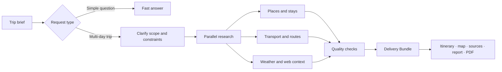

<div align="center">

<h1>JourneyPilot</h1>

<p>
  <picture>
    <source media="(prefers-color-scheme: dark)" srcset="assets/logo-lockup-night.png">
    <source media="(prefers-color-scheme: light)" srcset="assets/logo-lockup-day.png">
    
  </picture>
</p>

<strong>Evidence-backed travel planning, from a rough idea to a trip you can use.</strong>

<p>
JourneyPilot researches transport, places, weather, routes, and the open web, then brings everything together in a day-by-day itinerary, map, report, and printable PDF.
</p>

[](LICENSE)
[](https://python.org)
[](https://github.com/langchain-ai/langgraph)
[](https://modelcontextprotocol.io/)
[](https://react.dev/)

**English** | [简体中文](README.zh-CN.md)

[Overview](#overview) · [Highlights](#highlights) · [Quick start](#quick-start) · [How it works](#how-it-works) · [Configuration](#configuration) · [Development](#development)

</div>

<p align="center">
  
</p>

## Overview

JourneyPilot is an open-source AI travel planning workspace. Give it your dates, destinations, preferences, and constraints, and it turns provider data into a trip you can review and refine instead of a one-off answer hidden in a chat.

The itinerary, supporting facts, weather, map, report, and PDF stay connected throughout the planning process. Sources remain attached to the details they support, so train numbers, prices, travel times, and place information are easy to check before you go.

The current product interface is in Simplified Chinese. Code, configuration, and API contracts are written in English.

## Highlights

- **Research grounded in provider data** — connect rail, flight, map, weather, currency, and web-search services to build a trip from current information.
- **A structured daily itinerary** — visits, meals, stays, and transport are arranged with time windows, durations, costs, and researched connections between stops.
- **One connected workspace** — the interactive plan, sources, map, full report, and PDF are generated from the same delivery record.
- **Weather-aware planning** — forecasts are considered while the itinerary is being built, with practical alternatives for affected days.
- **Control over long-running plans** — review the research plan, resume interrupted work, make bounded edits, undo recent changes, or cancel a run cleanly.
- **Personal context** — remember common departure points and travel preferences, and search uploaded guides through the built-in knowledge base.

## Product tour

<table>
<tr>
<td width="50%" valign="top">

### A clear day-by-day plan

Every stop has a place in the schedule. Visits, dining, lodging, and transport each carry the details you need to understand the day at a glance.

</td>
<td width="50%" valign="top">


</td>
</tr>
<tr>
<td width="50%" valign="top">

### Details you can verify

Routes, schedules, durations, prices, providers, and source links stay next to the itinerary item they support.

</td>
<td width="50%" valign="top">


</td>
</tr>
<tr>
<td width="50%" valign="top">

### A report ready to share

The full report follows the same itinerary shown in the workspace and can be exported as a server-rendered PDF.

</td>
<td width="50%" valign="top">


</td>
</tr>
</table>

## Quick start

### Prerequisites

- [uv](https://docs.astral.sh/uv/)
- Docker Desktop or Docker Engine with Compose
- Python 3.11
- Node.js 18+ and npm

### Run JourneyPilot

```bash
git clone https://github.com/Dreamaker-TA/JourneyPilot.git
cd JourneyPilot
cp config.example.yaml config.yaml
```

Fill in the model section from a provider preset, then supply the API key through the
environment. Keys never belong in `config.yaml` — that file gets copied, committed and
pasted into issues:

```bash
uv run python journeypilot.py configure --list              # available presets
uv run python journeypilot.py configure --provider deepseek # writes the model section
export JOURNEYPILOT_PRIMARY_MODEL__API_KEY="your-api-key"
export JOURNEYPILOT_FAST_MODEL__API_KEY="your-api-key"
```

Start the app with the database and Redis ports used by the included Compose stack:

```bash
JOURNEYPILOT_DATABASE__PORT=55433 JOURNEYPILOT_REDIS__PORT=16379 ./run.sh
```

The first start installs backend and frontend dependencies and starts PostgreSQL, Redis, the API, and the web app. The default local embedding model is downloaded on first use.

| Service | URL |
|---|---|
| Web app | <http://localhost:8080> |
| API documentation | <http://localhost:8001/docs> |
| Readiness check | <http://localhost:8001/api/health/ready> |

Useful commands:

```bash
./run.sh status
./run.sh logs backend      # or: ./run.sh logs frontend
./run.sh check
./run.sh stop
```

If you always use the included Compose stack, you can save `database.port: 55433` and `redis.port: 16379` in `config.yaml` and start later runs with `./run.sh`.

### Optional capabilities

The default install carries the core product: chat, planning, PostgreSQL/pgvector, Redis,
MCP tools, PDF export and document import. Heavier enhancements are opt-in, and a
configuration that asks for one without its dependency **refuses to start** rather than
failing on the first real call:

```bash
uv sync                            # core
uv sync --group local-embedding    # local Qwen3 ONNX embeddings (embedding.provider=qwen3)
uv sync --group cross-encoder      # BGE reranker (rerank.provider=cross_encoder, pulls torch)
```

The default Compose database is the official `pgvector` image and compiles nothing.
Chinese word segmentation (zhparser) is an optional profile, and a build failure there
leaves the default stack untouched:

```bash
docker compose --profile zhparser up -d --build postgres-zhparser redis api
```

Both profiles share one volume and one port, so name the services explicitly and rebuild
the lexical indexes after switching. `journeypilot doctor` reports the lexical
configuration actually in effect.

## How it works

JourneyPilot chooses an execution path based on the request. Simple travel questions use a fast-answer workflow. Multi-day trips enter a research workflow that clarifies the brief, resolves constraints, gathers provider data in parallel, checks the results, and assembles the final delivery.



Research workers return typed candidates rather than free-form itinerary text. Deterministic checks preserve source lineage, verify that required parts of the trip are covered, and request targeted follow-up research when something is missing. Once the result is ready, it is committed as a single `DeliveryBundle` and projected to every user-facing surface.

Under the hood, JourneyPilot combines a LangGraph workflow with FastAPI, PostgreSQL, Redis, Model Context Protocol tools, hybrid retrieval, and a React workspace. Checkpoints and durable run records keep longer planning sessions recoverable.

## Configuration

Settings are read from built-in defaults and `config.yaml`, with environment variables
taking precedence. Unknown fields are **rejected** rather than ignored, so a misspelled
key fails loudly instead of silently doing nothing.

- [`config.example.yaml`](config.example.yaml) — annotated starting point
- [`docs/configuration.md`](docs/configuration.md) — every field, default, range and
  environment-variable name (generated from the schema; `journeypilot config docs`)

```bash
uv run python journeypilot.py config show      # effective values + where each came from
uv run python journeypilot.py config validate  # check without starting the service
uv run python journeypilot.py config env       # every valid environment variable
```

Every field can be overridden with `JOURNEYPILOT_<section>__<field>`, for example
`JOURNEYPILOT_DATABASE__PORT=55433`. An unrecognised `JOURNEYPILOT_*` variable stops
startup — a typo should not be a silent no-op.

| Setting | What it controls |
|---|---|
| `primary_model.*` | Main OpenAI-compatible model used for planning and research. |
| `fast_model.*` | Optional lower-latency model. Empty connection values fall back to the primary model. |
| `embedding.*` | Local Qwen3 ONNX embeddings by default, or an OpenAI-compatible embedding service. |
| `run_control.plan_gate_enabled` | Pauses a deep-research run for plan review before research begins. |
| `rerank.*` | Second-stage ranking for knowledge-base retrieval. |
| `run_deadline.*` | The four time windows one deep research run may spend. |
| `run_budget.*` | Call, token and cost ceilings sealed when a run is authorised. |
| `provider_channels.*` | Per-upstream concurrency, so an ingest cannot starve online requests. |
| `ingest.*` | Upload and document-parsing limits (size, pages, zip expansion, timeout). |
| `mcp.servers.*` | Credentials and settings for external research providers. |

### Data sources

JourneyPilot can be useful with the providers that require no credentials, then gain broader coverage as more services are configured.

| Area | Included providers | Optional providers |
|---|---|---|
| Web research | DuckDuckGo, Fetch | Tavily, Brave, Firecrawl |
| Places and routing | OpenStreetMap, Nominatim, Transitous | Baidu Maps, Amap |
| Transport | China Railway (12306) | Duffel Flights |
| Weather and currency | Open-Meteo, Frankfurter | — |

Add provider credentials under `mcp.servers` in `config.yaml`, then check their status with:

```bash
uv run python scripts/check_mcp.py
```

`config.yaml`, `.env*`, and other local credential files are ignored by Git.

The optional local knowledge corpus is intentionally not included in this public repository. If you maintain a local seed, keep it under `data/corpus/seed/`; the `data/` directory is ignored by Git. Without a local seed, provider-backed research still works and the knowledge corpus is reported as a non-blocking degraded component.

## Database, backups, and upgrades

The API process issues no DDL at all. It creates no tables, alters no columns, and deletes no rows on startup — it only verifies, read-only, that the database matches the schema contract of the code that is running. Schema changes are versioned migrations under [`migrations/versions/`](migrations/versions/), applied by the `journeypilot` command:

```bash
uv run python journeypilot.py doctor          # database, migration revision, schema, extensions, backups
uv run python journeypilot.py migrate         # run pending migrations (holds a lock; backs up first)
uv run python journeypilot.py backup          # verified backup: dump + manifest + SHA-256 checksums
uv run python journeypilot.py restore <dir>   # restore into a new database, verify, then switch
```

Every command accepts `--json` for CI use.

`migrate` runs **before** the API, not alongside it. Both supported entry points do this for you — the Docker image's entrypoint and `./run.sh start` each run it and refuse to start the API if it does not pass. Running the API against a database that has not been migrated is not a degraded mode: `GET /api/health/ready` returns 503 with the exact problem and the command that fixes it, and no request is served.

Because the API never needs DDL rights, you can run it under a PostgreSQL role that only has `SELECT/INSERT/UPDATE/DELETE` and sequence usage, and reserve schema ownership for `journeypilot migrate`. This is verified by a test, not just asserted.

What the safeguards actually do:

- **A non-empty database is backed up before any migration**, and the backup is verified (non-empty file, `pg_restore --list` parses, checksums recorded). If the backup fails, the migration does not run.
- **A database whose structure does not match a known revision is refused, never stamped.** `doctor` prints the exact columns, constraints, and indexes that differ.
- **Migrations that delete data require `--allow-destructive`.** A first install on an empty database does not, because there is nothing to lose.
- **Restore never overwrites the current database in place.** It restores into a new database, checks the schema fingerprint and row counts against the manifest, and only then switches. The previous database is kept as `<name>_prerestore_<timestamp>` until you delete it.

- **The LangGraph checkpoint tables are created by `migrate` too**, not by the API. They are owned by `langgraph-checkpoint-postgres` and carry their own version table, so they stay out of our migration history — but creating them is still DDL. Without them the API reports `checkpointer` as unavailable at startup rather than failing on the first interrupt.

`maintenance.*` in `config.yaml` controls the backup directory, retention, and the lock timeout. Backups are written outside version control.

## Development

Run the frontend against the local API:

```bash
cd frontend
npm install
npm run dev
```

Before opening a pull request, run the relevant checks:

```bash
# Backend
uv run ruff check src
JOURNEYPILOT_DATABASE__PORT=55433 uv run pytest   # migration/backup tests use temporary databases; skipped without PostgreSQL

# Frontend
cd frontend
npm run type-check
npm run build
```

Issues and pull requests are welcome. Keep changes focused, add a regression test for bug fixes, and update both README languages when behavior visible to users changes.

## Tech stack

| Layer | Technology |
|---|---|
| Frontend | React 18, TypeScript, Vite, Tailwind CSS, Leaflet, Motion |
| API | FastAPI, Uvicorn, Server-Sent Events |
| Agent workflow | LangGraph with PostgreSQL checkpoints |
| Models | OpenAI-compatible model routing through `langchain-openai` |
| Data | PostgreSQL, pgvector, Redis (zhparser optional) |
| Retrieval | Vector search, PostgreSQL full-text search, RRF, reranking |
| Tools | Model Context Protocol over stdio |
| Packaging | uv, npm, Docker Compose |

## License

JourneyPilot is available under the [MIT License](LICENSE).

## Acknowledgments

JourneyPilot builds on [LangGraph](https://github.com/langchain-ai/langgraph), the [Model Context Protocol](https://modelcontextprotocol.io/), [pgvector](https://github.com/pgvector/pgvector), and open data from [Open-Meteo](https://open-meteo.com/), [Frankfurter](https://frankfurter.dev/), [OpenStreetMap](https://www.openstreetmap.org/), Nominatim, and [Transitous](https://transitous.org/).
