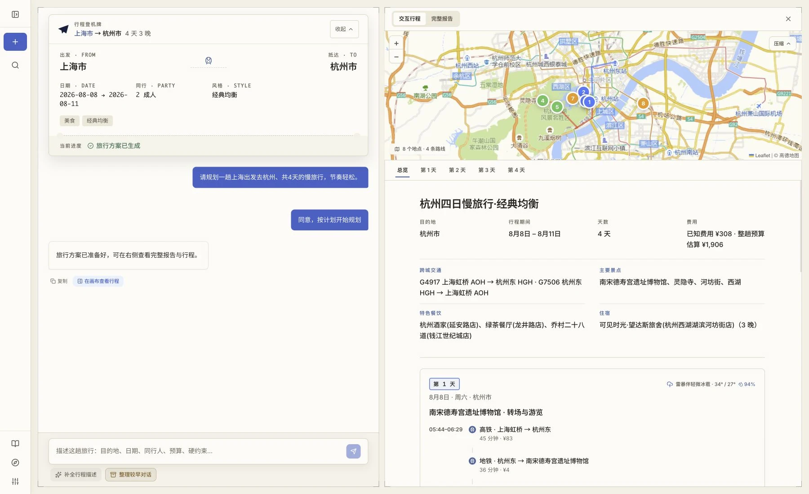
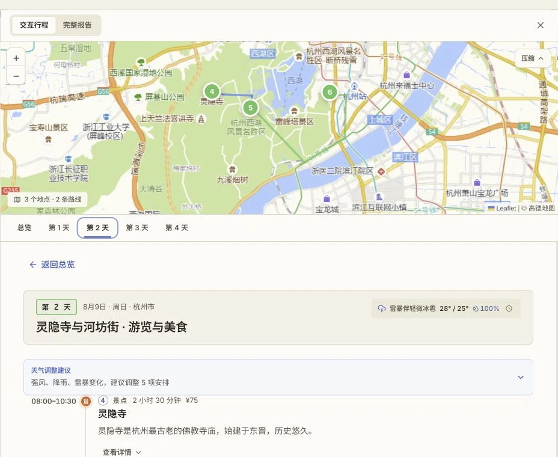
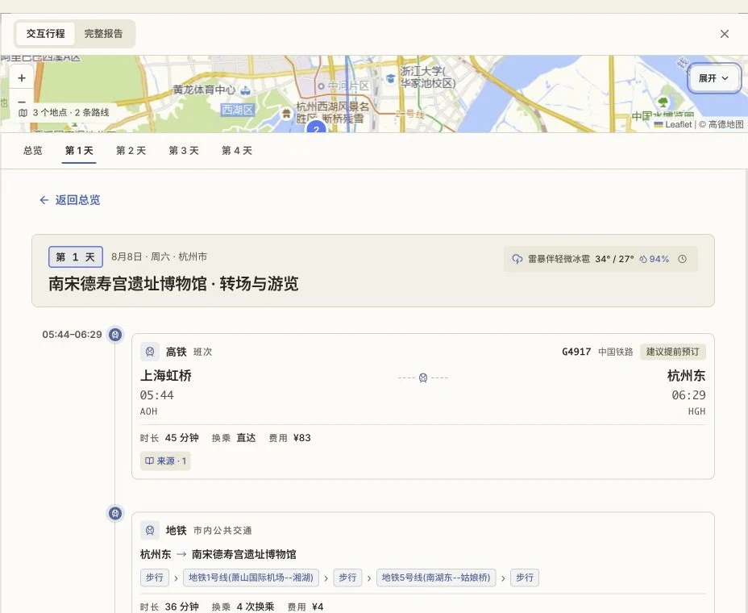
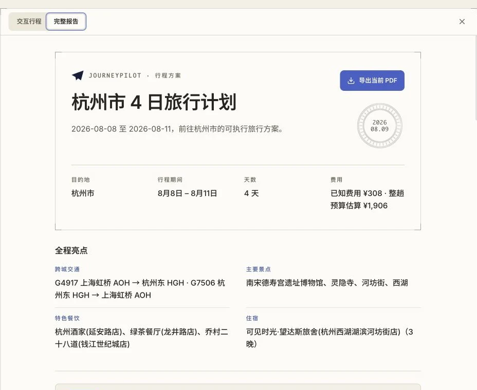
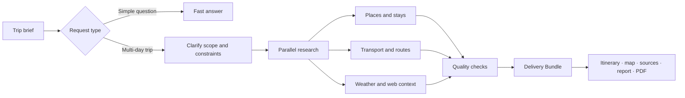

<div align="center">

<h1>JourneyPilot</h1>

<p>
  <picture>
    <source media="(prefers-color-scheme: dark)" srcset="assets/logo-lockup-night.png">
    <source media="(prefers-color-scheme: light)" srcset="assets/logo-lockup-day.png">
    
  </picture>
</p>

<strong>Evidence-backed travel planning, from a rough idea to a trip you can use.</strong>

<p>
JourneyPilot researches transport, places, weather, routes, and the open web, then brings everything together in a day-by-day itinerary, map, report, and printable PDF.
</p>

[](LICENSE)
[](https://python.org)
[](https://github.com/langchain-ai/langgraph)
[](https://modelcontextprotocol.io/)
[](https://react.dev/)

**English** | [简体中文](README.zh-CN.md)

[Overview](#overview) · [Highlights](#highlights) · [Quick start](#quick-start) · [How it works](#how-it-works) · [Configuration](#configuration) · [Development](#development)

</div>

<p align="center">
  
</p>

## Overview

JourneyPilot is an open-source AI travel planning workspace. Give it your dates, destinations, preferences, and constraints, and it turns provider data into a trip you can review and refine instead of a one-off answer hidden in a chat.

The itinerary, supporting facts, weather, map, report, and PDF stay connected throughout the planning process. Sources remain attached to the details they support, so train numbers, prices, travel times, and place information are easy to check before you go.

The current product interface is in Simplified Chinese. Code, configuration, and API contracts are written in English.

## Highlights

- **Research grounded in provider data** — connect rail, flight, map, weather, currency, and web-search services to build a trip from current information.
- **A structured daily itinerary** — visits, meals, stays, and transport are arranged with time windows, durations, costs, and researched connections between stops.
- **One connected workspace** — the interactive plan, sources, map, full report, and PDF are generated from the same delivery record.
- **Weather-aware planning** — forecasts are considered while the itinerary is being built, with practical alternatives for affected days.
- **Control over long-running plans** — review the research plan, resume interrupted work, make bounded edits, undo recent changes, or cancel a run cleanly.
- **Personal context** — remember common departure points and travel preferences, and search uploaded guides through the built-in knowledge base.

## Product tour

<table>
<tr>
<td width="50%" valign="top">

### A clear day-by-day plan

Every stop has a place in the schedule. Visits, dining, lodging, and transport each carry the details you need to understand the day at a glance.

</td>
<td width="50%" valign="top">



</td>
</tr>
<tr>
<td width="50%" valign="top">

### Details you can verify

Routes, schedules, durations, prices, providers, and source links stay next to the itinerary item they support.

</td>
<td width="50%" valign="top">



</td>
</tr>
<tr>
<td width="50%" valign="top">

### A report ready to share

The full report follows the same itinerary shown in the workspace and can be exported as a server-rendered PDF.

</td>
<td width="50%" valign="top">



</td>
</tr>
</table>

## Quick start

### Prerequisites

- [uv](https://docs.astral.sh/uv/)
- Docker Desktop or Docker Engine with Compose
- Python 3.11
- Node.js 18+ and npm

### Run JourneyPilot

```bash
git clone https://github.com/Dreamaker-TA/JourneyPilot.git
cd JourneyPilot
cp config.example.yaml config.yaml
```

Open `config.yaml` and add your model settings:

```yaml
primary_model:
  api_key: "your-api-key"
  model_name: "your-model"
  base_url: "https://your-openai-compatible-endpoint/v1"
```

Start the app with the database and Redis ports used by the included Compose stack:

```bash
DB_PORT=55433 REDIS_PORT=16379 ./run.sh
```

The first start installs backend and frontend dependencies and starts PostgreSQL, Redis, the API, and the web app. The default local embedding model is downloaded on first use.

| Service | URL |
|---|---|
| Web app | <http://localhost:8080> |
| API documentation | <http://localhost:8001/docs> |
| Readiness check | <http://localhost:8001/api/health/ready> |

Useful commands:

```bash
./run.sh status
./run.sh logs backend      # or: ./run.sh logs frontend
./run.sh check
./run.sh stop
```

If you always use the included Compose stack, you can save `database.port: 55433` and `redis.port: 16379` in `config.yaml` and start later runs with `./run.sh`.

## How it works

JourneyPilot chooses an execution path based on the request. Simple travel questions use a fast-answer workflow. Multi-day trips enter a research workflow that clarifies the brief, resolves constraints, gathers provider data in parallel, checks the results, and assembles the final delivery.



Research workers return typed candidates rather than free-form itinerary text. Deterministic checks preserve source lineage, verify that required parts of the trip are covered, and request targeted follow-up research when something is missing. Once the result is ready, it is committed as a single `DeliveryBundle` and projected to every user-facing surface.

Under the hood, JourneyPilot combines a LangGraph workflow with FastAPI, PostgreSQL, Redis, Model Context Protocol tools, hybrid retrieval, and a React workspace. Checkpoints and durable run records keep longer planning sessions recoverable.

## Configuration

Settings are read from built-in defaults and `config.yaml`, with environment variables taking precedence. [`config.example.yaml`](config.example.yaml) documents the available options.

| Setting | What it controls |
|---|---|
| `primary_model.*` | Main OpenAI-compatible model used for planning and research. |
| `fast_model.*` | Optional lower-latency model. Empty connection values fall back to the primary model. |
| `embedding.*` | Local Qwen3 ONNX embeddings by default, or an OpenAI-compatible embedding service. |
| `run_control.plan_gate_enabled` | Pauses a deep-research run for plan review before research begins. |
| `rerank.*` | Second-stage ranking for knowledge-base retrieval. |
| `mcp.servers.*` | Credentials and settings for external research providers. |

### Data sources

JourneyPilot can be useful with the providers that require no credentials, then gain broader coverage as more services are configured.

| Area | Included providers | Optional providers |
|---|---|---|
| Web research | DuckDuckGo, Fetch | Tavily, Brave, Firecrawl |
| Places and routing | OpenStreetMap, Nominatim, Transitous | Baidu Maps, Amap |
| Transport | China Railway (12306) | Duffel Flights |
| Weather and currency | Open-Meteo, Frankfurter | — |

Add provider credentials under `mcp.servers` in `config.yaml`, then check their status with:

```bash
uv run python scripts/check_mcp.py
```

`config.yaml`, `.env*`, and other local credential files are ignored by Git.

The optional local knowledge corpus is intentionally not included in this public repository. If you maintain a local seed, keep it under `data/corpus/seed/`; the `data/` directory is ignored by Git. Without a local seed, provider-backed research still works and the knowledge corpus is reported as a non-blocking degraded component.

## Development

Run the frontend against the local API:

```bash
cd frontend
npm install
npm run dev
```

Before opening a pull request, run the relevant checks:

```bash
# Backend
uv run ruff check src
uv run pytest

# Frontend
cd frontend
npm run type-check
npm run build
```

Issues and pull requests are welcome. Keep changes focused, add a regression test for bug fixes, and update both README languages when behavior visible to users changes.

## Tech stack

| Layer | Technology |
|---|---|
| Frontend | React 18, TypeScript, Vite, Tailwind CSS, Leaflet, Motion |
| API | FastAPI, Uvicorn, Server-Sent Events |
| Agent workflow | LangGraph with PostgreSQL checkpoints |
| Models | OpenAI-compatible model routing through `langchain-openai` |
| Data | PostgreSQL, pgvector, zhparser, Redis |
| Retrieval | Vector search, PostgreSQL full-text search, RRF, reranking |
| Tools | Model Context Protocol over stdio |
| Packaging | uv, npm, Docker Compose |

## License

JourneyPilot is available under the [MIT License](LICENSE).

## Acknowledgments

JourneyPilot builds on [LangGraph](https://github.com/langchain-ai/langgraph), the [Model Context Protocol](https://modelcontextprotocol.io/), [pgvector](https://github.com/pgvector/pgvector), and open data from [Open-Meteo](https://open-meteo.com/), [Frankfurter](https://frankfurter.dev/), [OpenStreetMap](https://www.openstreetmap.org/), Nominatim, and [Transitous](https://transitous.org/).
