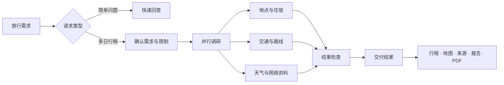

<div align="center">

<h1>JourneyPilot</h1>

<p>
  <picture>
    <source media="(prefers-color-scheme: dark)" srcset="assets/logo-lockup-night.png">
    <source media="(prefers-color-scheme: light)" srcset="assets/logo-lockup-day.png">
    
  </picture>
</p>

<strong>把想去的地方，变成有来源、能落地的行程。</strong>

<p>
JourneyPilot 会查询交通、地点、天气、路线和公开资料，再把结果整理成按天行程、地图、完整报告和可打印的 PDF。
</p>

[](LICENSE)
[](https://python.org)
[](https://github.com/langchain-ai/langgraph)
[](https://modelcontextprotocol.io/)
[](https://react.dev/)

[English](README.md) | **简体中文**

[项目介绍](#项目介绍) · [主要功能](#主要功能) · [快速开始](#快速开始) · [工作方式](#工作方式) · [配置](#配置) · [参与开发](#参与开发)

</div>

<p align="center">
  
</p>

## 项目介绍

JourneyPilot 是一个开源的 AI 旅行规划工作台。告诉它出行日期、目的地、偏好和限制，它会把查到的信息整理成一份可以继续查看、调整和导出的行程，而不是让结果停留在一段聊天回复里。

行程安排、事实来源、天气、地图、完整报告和 PDF 始终放在同一个工作台里。车次、价格、路程时间和地点信息都会保留对应的来源，出发前可以很方便地逐项确认。

当前产品界面使用简体中文，代码、配置和 API 契约使用英文。

## 主要功能

- **查过再写**：可以接入铁路、航班、地图、天气、汇率和网络搜索服务，用实时查询结果支撑行程。
- **按天安排清楚**：景点、用餐、住宿和交通都有自己的时间、时长、费用和前后衔接。
- **所有结果放在一起**：交互行程、来源、地图、报告和 PDF 来自同一份交付结果，修改后也会一起更新。
- **让天气真正影响行程**：规划时就会考虑天气，并为受影响的日期准备更合适的替代安排。
- **长任务也能掌控**：开始调研前可以先确认计划；运行中断后可以恢复，也可以调整、撤销最近的修改或取消任务。
- **记住常用信息**：保存常用出发地和旅行偏好，还能从上传的攻略中检索需要的内容。

## 产品预览

<table>
<tr>
<td width="50%" valign="top">

### 一眼看懂每天怎么走

每天的景点、餐饮、住宿和交通都排在清晰的时间线上，打开行程就能看懂当天的节奏。

</td>
<td width="50%" valign="top">


</td>
</tr>
<tr>
<td width="50%" valign="top">

### 重要信息随时可查

路线、班次、时长、价格、数据提供方和来源链接，会直接放在对应的行程项旁边。

</td>
<td width="50%" valign="top">


</td>
</tr>
<tr>
<td width="50%" valign="top">

### 随时整理成完整报告

完整报告和工作台里的行程保持一致，也可以导出为服务端生成的 PDF，方便保存或分享。

</td>
<td width="50%" valign="top">


</td>
</tr>
</table>

## 快速开始

### 需要准备

- [uv](https://docs.astral.sh/uv/)
- Docker Desktop，或支持 Compose 的 Docker Engine
- Python 3.11
- Node.js 18+ 和 npm

### 启动 JourneyPilot

```bash
git clone https://github.com/Dreamaker-TA/JourneyPilot.git
cd JourneyPilot
cp config.example.yaml config.yaml
```

打开 `config.yaml`，填入模型服务信息：

```yaml
primary_model:
  api_key: "your-api-key"
  model_name: "your-model"
  base_url: "https://your-openai-compatible-endpoint/v1"
```

使用仓库自带的 Docker Compose 数据库和 Redis 端口启动：

```bash
DB_PORT=55433 REDIS_PORT=16379 ./run.sh
```

第一次启动会安装前后端依赖，并依次拉起 PostgreSQL、Redis、API 和网页端。默认的本地向量模型会在首次使用时下载。

| 服务 | 地址 |
|---|---|
| 网页端 | <http://localhost:8080> |
| API 文档 | <http://localhost:8001/docs> |
| 就绪检查 | <http://localhost:8001/api/health/ready> |

常用命令：

```bash
./run.sh status
./run.sh logs backend      # 前端日志使用 frontend
./run.sh check
./run.sh stop
```

如果一直使用仓库自带的 Compose 服务，可以把 `database.port: 55433` 和 `redis.port: 16379` 写入 `config.yaml`，之后直接运行 `./run.sh`。

## 工作方式

JourneyPilot 会先判断请求适合快速回答还是完整规划。签证、汇率等简单问题会直接进入快速流程；多日行程则会先梳理需求和硬性限制，再并行查询地点、住宿、交通、路线、天气和公开资料，检查结果后生成最终行程。



调研阶段返回的是带有明确字段和来源的候选结果，而不是直接写一篇行程。系统会检查各个部分是否完整、来源是否保留下来；发现缺项时，只补查对应的内容。确认完成后，结果会写入一份 `DeliveryBundle`，再生成工作台里的所有内容。

JourneyPilot 的后端使用 LangGraph 和 FastAPI，数据保存在 PostgreSQL 和 Redis 中，通过 MCP 工具连接外部服务，并结合混合检索与 React 工作台完成整个规划流程。检查点和持久化的运行记录让耗时较长的任务可以继续恢复。

## 配置

JourneyPilot 会先读取内置默认值和 `config.yaml`，环境变量拥有最高优先级。所有可配置项都写在带注释的 [`config.example.yaml`](config.example.yaml) 中。

| 配置 | 作用 |
|---|---|
| `primary_model.*` | 规划和调研使用的主要模型，支持 OpenAI 兼容接口。 |
| `fast_model.*` | 可选的低延迟模型；连接信息留空时会沿用主要模型。 |
| `embedding.*` | 默认使用本地 Qwen3 ONNX 向量模型，也可以连接 OpenAI 兼容的向量服务。 |
| `run_control.plan_gate_enabled` | 完整调研开始前是否暂停，等待确认研究计划。 |
| `rerank.*` | 知识库检索的第二阶段排序。 |
| `mcp.servers.*` | 外部数据服务的密钥与连接设置。 |

### 数据来源

无需密钥的数据源已经可以覆盖基础功能；继续配置其他服务后，可以获得更广的搜索和路线覆盖。

| 类型 | 自带数据源 | 可选数据源 |
|---|---|---|
| 网络资料 | DuckDuckGo、Fetch | Tavily、Brave、Firecrawl |
| 地点与路线 | OpenStreetMap、Nominatim、Transitous | 百度地图、高德地图 |
| 交通 | 中国铁路 12306 | Duffel 航班 |
| 天气与汇率 | Open-Meteo、Frankfurter | — |

在 `config.yaml` 的 `mcp.servers` 下填入服务密钥，然后运行：

```bash
uv run python scripts/check_mcp.py
```

`config.yaml`、`.env*` 和其他本地密钥文件都已加入 Git 忽略列表。

可选的本地知识库没有随这个公开仓库发布。如果你维护本地种子文件，请放在 `data/corpus/seed/` 下；整个 `data/` 目录都已被 Git 忽略。没有本地种子时，基于 Provider 的调研仍可运行，知识库只会在就绪检查中作为非阻塞降级项报告。

## 数据库、备份与升级

API 进程不执行任何 DDL：不建表、不改列、不删数据，启动时只**只读**校验「这个库是否匹配当前代码的结构合同」。结构变更是 [`migrations/versions/`](migrations/versions/) 下的版本化迁移，由 `journeypilot` 执行：

```bash
uv run python journeypilot.py doctor          # 体检：数据库、迁移版本、结构、扩展、备份现状
uv run python journeypilot.py migrate         # 执行待迁移（持锁；非空库先自动备份）
uv run python journeypilot.py backup          # 生成经过校验的备份：转储 + manifest + SHA-256
uv run python journeypilot.py restore <目录>   # 恢复到新库、验证通过后再切换
```

每个命令都支持 `--json`，供 CI 使用。

`migrate` 跑在 API **之前**，不是与它并行。两条官方入口都已经替你做了这件事：Docker 镜像的 entrypoint 和 `./run.sh start` 各自先跑一次迁移，不通过就不启动 API。让 API 连上一个没迁移过的库不是「降级运行」——`GET /api/health/ready` 返回 503，附上具体问题和那条能修好它的命令，一条业务请求都不会被服务。

因为 API 不需要 DDL 权限，你可以用一个只有 `SELECT/INSERT/UPDATE/DELETE` 和 sequence 使用权的 PostgreSQL 角色运行它，把结构所有权留给 `journeypilot migrate`。这一条有测试保证，不只是一句声明。

这几道保护具体做了什么：

- **非空数据库在任何迁移之前必定先备份**，而且备份要通过校验（文件非空、`pg_restore --list` 能解析、checksum 已记录）。备份失败就不迁移。
- **结构与任何已知 revision 都不匹配的数据库会被拒绝，绝不会被标记成最新版本。** `doctor` 会逐条列出差异的列、约束和索引。
- **会删数据的迁移需要 `--allow-destructive`。** 空库首次安装不需要 —— 那里没有数据可丢。
- **恢复绝不原地覆盖当前数据库。** 它先恢复到一个新库，比对结构指纹和行数，通过之后才切换；恢复前的数据库保留为 `<库名>_prerestore_<时间戳>`，直到你自己删除。

- **LangGraph 的 checkpoint 表同样由 `migrate` 建**，不由 API 建。它们的 owner 是 `langgraph-checkpoint-postgres` 并自带版本表，所以不进我们的迁移历史 —— 但建它们仍然是 DDL。缺了它们，API 在启动时就报 `checkpointer` 不可用，而不是等第一次 interrupt 才失败。

`config.yaml` 里的 `maintenance.*` 控制备份目录、保留份数和锁超时。备份目录不进版本控制。

## 参与开发

让前端连接本地 API：

```bash
cd frontend
npm install
npm run dev
```

提交 Pull Request 前，请运行与改动相关的检查：

```bash
# 后端
uv run ruff check src
DB_PORT=55433 uv run pytest    # 迁移/备份测试建临时库；没有 PostgreSQL 时自动跳过

# 前端
cd frontend
npm run type-check
npm run build
```

欢迎提交 Issue 和 Pull Request。请尽量让每次改动保持聚焦；修复缺陷时补上回归测试；如果改动影响用户可见的行为，也请同步更新中英文 README。

## 技术栈

| 层 | 技术 |
|---|---|
| 前端 | React 18、TypeScript、Vite、Tailwind CSS、Leaflet、Motion |
| API | FastAPI、Uvicorn、Server-Sent Events |
| Agent 工作流 | LangGraph 与 PostgreSQL 检查点 |
| 模型 | 通过 `langchain-openai` 接入 OpenAI 兼容模型 |
| 数据 | PostgreSQL、pgvector、zhparser、Redis |
| 检索 | 向量检索、PostgreSQL 全文检索、RRF、重排 |
| 工具 | 基于 stdio 的 Model Context Protocol |
| 包管理与运行 | uv、npm、Docker Compose |

## 许可

JourneyPilot 使用 [MIT License](LICENSE) 开源。

## 致谢

JourneyPilot 使用了 [LangGraph](https://github.com/langchain-ai/langgraph)、[Model Context Protocol](https://modelcontextprotocol.io/)、[pgvector](https://github.com/pgvector/pgvector)，以及来自 [Open-Meteo](https://open-meteo.com/)、[Frankfurter](https://frankfurter.dev/)、[OpenStreetMap](https://www.openstreetmap.org/)、Nominatim 和 [Transitous](https://transitous.org/) 的开放数据。
